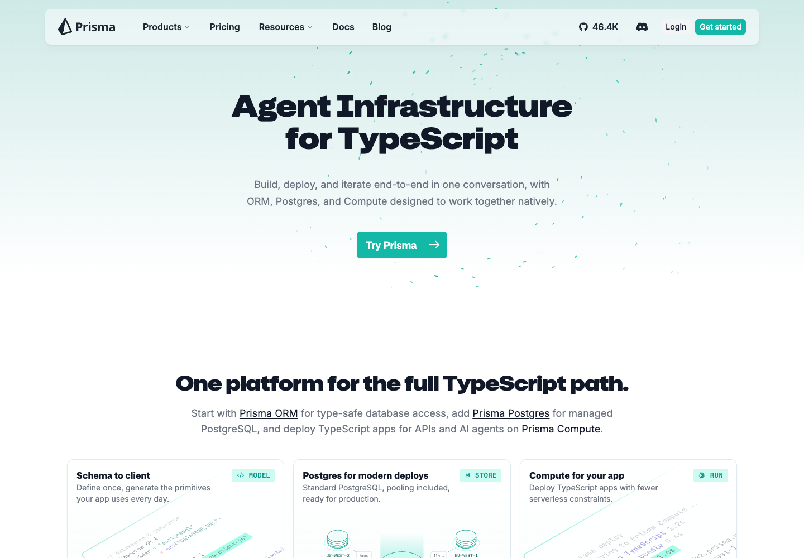

# DEPLOYED TO COMPUTE

This repository has been refactored and deployed to Prisma Compute using the monorepo app configuration in [`prisma.compute.ts`](prisma.compute.ts). The deployment uses three Compute apps: one for the homepage shell, one for docs, and one for the blog.

## Live URLs

| Surface | URL | Notes |
| --- | --- | --- |
| Homepage | [https://cmqkpxx900dea0ddxaoyu2s8l.fra.prisma.build/](https://cmqkpxx900dea0ddxaoyu2s8l.fra.prisma.build/) | Site app deployed from `apps/site`. |
| Docs | [https://cmqkoe8hg0cyt03l79u7thj20.fra.prisma.build/docs](https://cmqkoe8hg0cyt03l79u7thj20.fra.prisma.build/docs) | Docs app deployed from `apps/docs`. The homepage also proxies `/docs` to this app. |
| Blog | [https://cmqkpw54o0yp4zndvj3zei5ml.fra.prisma.build/blog](https://cmqkpw54o0yp4zndvj3zei5ml.fra.prisma.build/blog) | Blog app deployed from `apps/blog`. The homepage also proxies `/blog` to this app. |

## Screenshots

### Homepage



### Docs


### Blog


## Obstacles Report

| Obstacle | Resolution |
| --- | --- |
| The repository is a pnpm/Turbo monorepo, while Prisma Compute needs an explicit deploy shape. | Added [`prisma.compute.ts`](prisma.compute.ts) with three Compute apps: `site`, `docs`, and `blog`, each with its own root, build command, port, framework adapter, and environment. |
| The existing Next.js apps were not configured for Compute's standalone deployment requirements. | Added Compute-gated `output: "standalone"`, `outputFileTracingRoot`, and `turbopack.root` settings in the site, docs, and blog Next configs. These settings are enabled only when `PRISMA_COMPUTE_DEPLOY=true`, so normal local and production workflows keep their existing behavior. |
| Existing static asset prefixes such as `/site-static`, `/docs-static`, and `/blog-static` broke direct Compute asset loading. | Omitted those prefixes during Compute builds so the deployed apps can serve Next static assets from their own Compute origins. |
| Turbo was pruning deployment-only environment variables from builds. | Added `PRISMA_COMPUTE_DEPLOY`, `NEXT_DOCS_ORIGIN`, and `NEXT_BLOG_ORIGIN` to the Turbo build environment and set `PRISMA_COMPUTE_DEPLOY=true` directly in each Compute build command. |
| The homepage production build normally requires explicit blog and docs origins. | Bypassed that guard only for Compute builds, then configured the site Compute app with docs and blog origins so `/docs` and `/blog` can route to the deployed Compute apps. |
| Blog and docs search initialized the Mixedbread client at module load, which fails without `MIXEDBREAD_API_KEY`. | Changed both search API routes to lazily initialize Mixedbread only when a key exists. Missing keys now return an empty search result instead of failing the build or runtime. |
| Docs generated a large number of static routes during the Compute build. | Added Compute-specific `generateStaticParams()` guards for docs pages, LLMS routes, and OG routes so the Compute deployment can build a minimal runtime artifact instead of a full static export. |
| The blog `public` directory is very large and made the Compute upload impractical. | Avoided uploading the full public tree for the Compute proof. Blog media and deep routes are proxied to `www.prisma.io`, while the deployed `/blog` page and required Next chunks are served by Compute. |
| The docs Next standalone server exceeded Compute beta runtime limits when served directly. | Introduced [`scripts/compute-static-snapshot.mjs`](scripts/compute-static-snapshot.mjs), which builds the local standalone app, snapshots the deployed entry route, and emits a lightweight Bun server for Compute. |
| Prisma Compute's Bun adapter bundled only the configured entrypoint and did not ship sibling generated files. | Embedded the captured HTML and required `_next/static` assets into the generated `.compute/server.ts` file, making the docs and blog Compute runtimes self-contained. |
| The local machine hit disk pressure while iterating on Next/Turbo artifacts. | Removed generated cache and temporary deployment artifacts that were not needed, then kept `.compute`, `.playwright-cli`, and local Prisma cache output ignored. |
| The Compute CLI surfaced database URL warnings even though these apps do not need a database connection for this deployment. | Left database integration disabled and deployed without a Compute database binding. The warnings were non-blocking for static homepage, docs, and blog verification. |
| Preview-branch deployment was not necessary for this migration proof and introduced extra routing friction. | Used a dedicated Compute project named `web-compute-migration` with production branch `main` and deployed the three apps there. |
| The service token needed to be used for deployment without leaking credentials into source control. | Used the token only through the local CLI environment. The token is not stored in the repository or README. |

The docs and blog Compute apps are intentionally lightweight for this migration proof: they serve the verified entry pages and their required static chunks from Prisma Compute, and proxy deeper routes or large media assets to `www.prisma.io` to stay within the current Compute beta runtime and artifact limits.

# Prisma Documentation

[](https://github.com/prisma/docs/blob/main/CONTRIBUTING.md) [](https://discord.com/invite/prisma-937751382725886062?utm_source=twitter&utm_medium=bio&dub_id=0HxLEKaaOg6pL0OL)

This repository is a **pnpm monorepo** containing the Prisma documentation, blog, design system docs, and shared packages.

## Repository structure

| Path | Description |
|------|--------------|
| `apps/docs` | Prisma documentation site (Next.js + Fumadocs) |
| `apps/blog` | Prisma blog |
| `apps/eclipse` | Eclipse design system documentation |
| `packages/eclipse` | Eclipse design system component library (`@prisma/eclipse`) |
| `packages/ui` | Shared UI components and utilities (`@prisma-docs/ui`) |

See each app’s `README.md` for more detail.
See [ARCHITECTURE.md](ARCHITECTURE.md) for the cross-app multi-zone overview.

## Contributing

New contributors are welcome. Read the [contributing guide](CONTRIBUTING.md) before submitting changes.

## Run locally

From the repository root:

```bash
pnpm install
pnpm dev
```

This starts all apps via Turbo:

- **Site** — http://localhost:3000  
- **Docs** — http://localhost:3001  
- **Blog** — http://localhost:3002  
- **Eclipse** — http://localhost:3003  

To run a single app:

```bash
pnpm --filter docs dev      # docs only
pnpm --filter blog dev      # blog only
pnpm --filter eclipse dev   # eclipse design system docs only
```

## Build

```bash
pnpm build
```

To build and serve the docs site:

```bash
pnpm --filter docs build
pnpm --filter docs start
```

## Scripts

| Script | Description |
|--------|-------------|
| `pnpm lint:links` | Validate internal and external links (docs) |
| `pnpm lint:code` | Lint code blocks in MDX (docs) |
| `pnpm lint:spellcheck` | Spell-check content (docs) |
| `pnpm check` | Run formatting and lint fixes across all workspaces |

## Content

- **Docs** — `apps/docs/content/docs/` (latest), `apps/docs/content/docs.v6/` (versioned). Sidebar structure comes from `meta.json` in each folder. See [Fumadocs collections](https://fumadocs.dev/docs/mdx/collections).
- **Blog** — `apps/blog/content/blog/` (MDX with authors, dates, hero images).
- **Eclipse** — `apps/eclipse/content/design-system/` (component docs).

## Note on formatting

`.md` and `.mdx` files are not formatted by Prettier because they use [MDX 3](https://mdxjs.com/blog/v3/), which Prettier does not support. See [prettier/prettier#12209](https://github.com/prettier/prettier/issues/12209).
