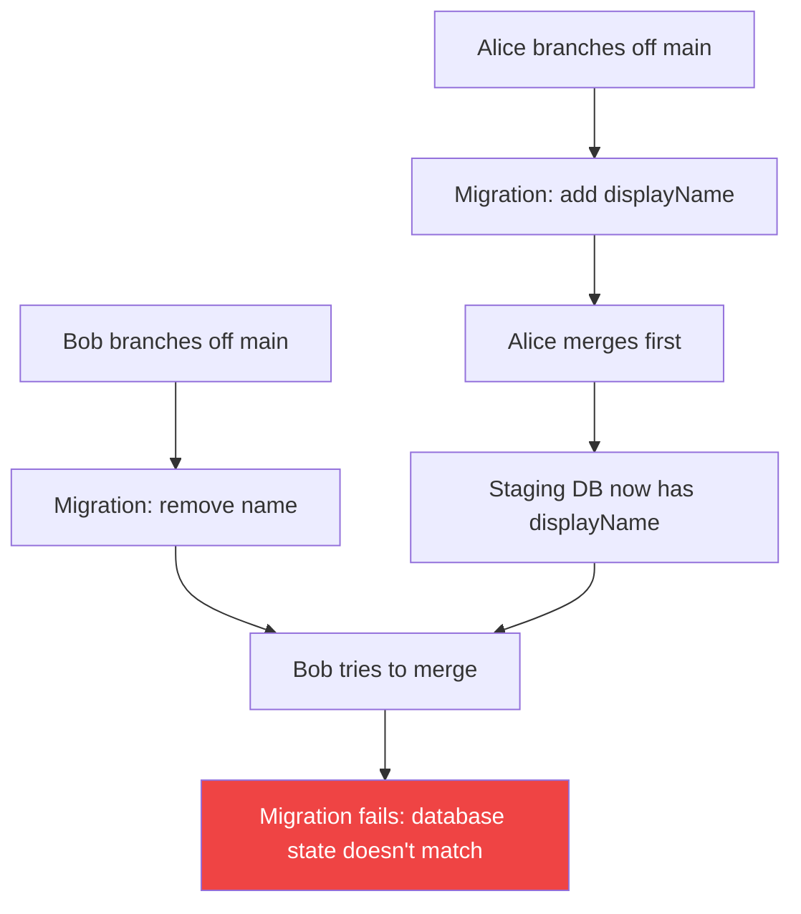
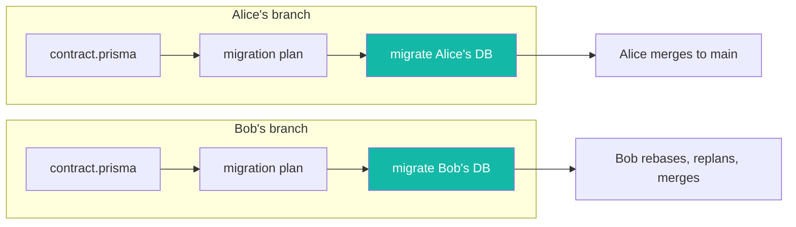
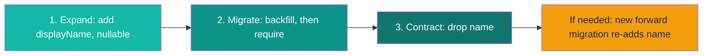

import {
  deployTerminalLines,
  expandContractBefore,
  expandContractAfter,
  expandTerminalLines,
  contractContractBefore,
  contractContractAfter,
  contractTerminalLines,
} from "./snippets";

**Give every branch its own database, and risky schema changes become routine.** [Prisma Compute](https://www.prisma.io/docs/compute) provisions an isolated [Prisma Postgres](https://www.prisma.io/docs/postgres) database for each branch you deploy. Migrations from different pull requests stop colliding, and destructive changes get a full rehearsal on real infrastructure before they touch production.

This post walks through the workflow: why a shared staging database breaks under concurrent schema changes, how per-branch databases remove the conflict, and how to rehearse a destructive change end-to-end with the expand-and-contract pattern.

:::note

Three Prisma products appear here, each with one job:

- **Prisma Compute** (Public Beta) hosts your app and provisions a database per branch. It provides the isolation.
- **Prisma Postgres** is the database each branch gets.
- **[Prisma Next](https://www.prisma.io/docs/orm)** (Early Access; it becomes Prisma 8 at general availability) provides the migration toolchain in the examples. The same workflow also works with Prisma 7's `prisma migrate deploy`.

:::

## Why a shared staging database breaks

A shared staging database has one state. Concurrent branches need different ones. When two developers change the schema in the same sprint, they collide:

1. Alice branches off `main`, adds a `displayName` column, and migrates the shared staging database.
2. Bob branches off `main`, removes a legacy `name` column, and migrates the same database.
3. Alice merges first. Her migration becomes the new baseline on `main`.
4. Bob tries to merge. The staging database now reflects Alice's schema, not the one his migration was written against. His migration fails, or worse, half-applies.



[Prisma Next migrations](https://pris.ly/ts-migrations-pn) make this failure precise instead of silent: every migration records the contract state it starts `from` and the state it moves `to`, and the runner refuses to apply a migration against a database in the wrong state. That check is what makes re-runs safe. It's also what turns Bob's merge into a hard error rather than a corrupted staging environment.

The conventional workarounds all paper over the same root cause:

- **Rebase and replan**: Bob replans his migration against Alice's baseline and hopes it still does what he intended. Works for additive changes, gets fragile with data transformations.
- **Reset staging on every merge**: re-apply every migration from scratch. Technically sound, but it destroys the data your integration tests rely on.
- **Sequential merges**: only one person touches the schema at a time. The de facto standard, and the slowest option.

One database, multiple migration timelines. The fix is more databases.

## One database per branch

On Prisma Compute, a branch is a real resource that owns its own app and its own database. Deploy a branch name that doesn't exist yet and Compute provisions an isolated environment for it:

<AgentPrompt
  prompt="Deploy this branch to Compute with its own database."
  skill="prisma-cli"
  terminalCommand="npx @prisma/cli@latest app deploy --branch remove-legacy-name --db"
  terminalLines={deployTerminalLines}
/>

Alice's branch gets a database with her schema. Bob's branch gets a database with his. Neither can break the other, and neither needs to rebase until merge time. When Bob does rebase after Alice merges, he replans against the updated contract and tests the result on his own branch database first.



Isolation solves the concurrency problem. It also unlocks something better: a safe place to rehearse changes that are dangerous by nature. That's where expand-and-contract comes in.

## Rehearse the risky change: expand and contract

Renaming a column, changing a type, dropping a field that production code still reads: one big migration for any of these breaks whatever is running while it applies. The safe version splits the change into three small, individually harmless migrations:

1. **Expand**: add the new schema next to the old. Both code paths work.
2. **Migrate**: backfill data from old to new, inside a migration.
3. **Contract**: remove the old schema once nothing reads it.

The pattern is well known and rarely practiced, because rehearsing a three-migration sequence on a shared database is exactly the kind of multi-deploy work that collides with everyone else. On a branch database, you run the whole cycle in isolation, verify each step, and only then promote it to production.

Here's the cycle for replacing a legacy `name` column with `displayName`.

### Step 1: Expand

Add `displayName` as nullable, so existing code that only knows about `name` keeps working:

<AgentPrompt
  prompt="Add a displayName column to User without breaking the code that still reads name."
  language="prisma"
  fileName="contract.prisma"
  skill="prisma-next-migrations"
  before={expandContractBefore}
  after={expandContractAfter}
  terminalCommand="npx prisma-next migration plan --name add_display_name"
  terminalLines={expandTerminalLines}
/>

The planner turns the contract diff into a TypeScript migration:

```typescript
// migrations/app/20260724T1000_add_display_name/migration.ts (excerpt)

override get operations() {
  return [
    this.addColumn({
      schema: "public",
      table: "user",
      column: col("displayName", "text", { codecRef: { codecId: "pg/text@1" } }),
    }),
  ];
}
```

Apply it to your branch database with `npx prisma-next migrate` and deploy the branch. Old code still reads `name`; new code can start writing `displayName`.

### Step 2: Migrate

Make `displayName` required in the contract, and the planner scaffolds the fix it knows is needed: a backfill sandwiched before the `NOT NULL` constraint. Instead of a standalone script that runs outside your migration history, the backfill lives [inside the migration](https://pris.ly/data-migrations-pn) as a `dataTransform`, written with the same type-safe query builder you use in your app:

```typescript
// migrations/app/20260724T1100_require_display_name/migration.ts (excerpt)

override get operations() {
  return [
    this.dataTransform(endContract, "backfill-user-displayName", {
      check: () =>
        db.public.user
          .select("id")
          .where((f, fns) => fns.eq(f.displayName, null))
          .limit(1),
      run: () =>
        db.public.user
          .update((f, fns) => ({
            displayName: fns.raw`COALESCE(${f.name}, 'Anonymous')`.returns("pg/text@1"),
          }))
          .where((f, fns) => fns.eq(f.displayName, null)),
    }),
    this.setNotNull({ schema: "public", table: "user", column: "displayName" }),
  ];
}
```

`check` asks "are there rows that still need this?" and `run` performs the change, here copying each row's `name` into `displayName`. Both are typed against this migration's own contract snapshot, not your live schema, which is why the query can reference `name` even though a later migration drops it.

After editing, recompile with `node migration.ts`. The `dataTransform` compiles to the same `precheck` / `execute` / `postcheck` JSON as every other operation: reviewers read your intent in `migration.ts` and the exact SQL in `ops.json`, and production only ever runs the compiled JSON, never your TypeScript. See [Editing a migration](https://www.prisma.io/docs/orm/next/migrations/editing-a-migration) for the full file, including the wiring that builds the typed `db` handle.

Run it against the branch database. Check the data. Nothing has touched production yet.

### Step 3: Contract

Once all code reads `displayName` and the backfill is verified, remove the old column:

<AgentPrompt
  prompt="Nothing reads the legacy name column anymore. Remove it."
  language="prisma"
  fileName="contract.prisma"
  skill="prisma-next-migrations"
  before={contractContractBefore}
  after={contractContractAfter}
  terminalCommand="npx prisma-next migration plan --name drop_legacy_name"
  terminalLines={contractTerminalLines}
/>

Plan, apply, deploy. Three migrations, each boring on its own, and the whole sequence rehearsed on a branch database before production sees any of it.



## Roll forward, not back

Why rehearse at all, instead of relying on rollbacks? Because schema rollbacks don't really exist.

Promoting an earlier deployment on Compute restores your app code, not your schema; the database keeps the state from the most recent migration. And Prisma Next's migration history is append-only by design: generating an inverse migration is unsafe for production data, because you can't un-drop a column.

If a change goes wrong, you write a new forward migration that restores the old structure. Expand-and-contract keeps every one of those forward steps small, and per-branch databases give you a place to rehearse the sequence until it's boring.

## Automate it in CI

Once the manual workflow feels routine, wire it into your pipeline so every pull request gets its own database, migration run, and test pass:

```yaml
# .github/workflows/branch-preview.yml
name: Branch preview

on:
  pull_request:

jobs:
  deploy-preview:
    runs-on: ubuntu-latest
    steps:
      - uses: actions/checkout@v4

      - uses: actions/setup-node@v4
        with:
          node-version: 22

      - run: npm ci

      - name: Apply migrations to the branch database
        run: |
          npx prisma-next contract emit
          npx prisma-next migrate
        env:
          # This branch's database connection string, e.g. from a
          # branch-scoped environment variable on the Compute project.
          DATABASE_URL: ${{ secrets.BRANCH_DB_URL }}

      - name: Deploy the branch to Compute
        run: |
          npx @prisma/cli@latest app deploy \
            --branch "$GITHUB_HEAD_REF" \
            --json \
            --no-interactive
        env:
          PRISMA_SERVICE_TOKEN: ${{ secrets.PRISMA_SERVICE_TOKEN }}

      - name: Integration tests against the branch database
        run: npm test
        env:
          DATABASE_URL: ${{ secrets.BRANCH_DB_URL }}
```

If you [connect the project to GitHub](https://www.prisma.io/docs/compute/github), Compute also creates and tears down platform branches on push and branch-delete events automatically.

## When you don't need this

If you're a solo developer, or your team rarely touches the schema, shared staging is fine. The conflict rate is low enough that an occasional rebase doesn't hurt.

Per-branch databases earn their keep when:

- multiple developers ship schema changes in the same sprint,
- you run expand-and-contract migrations that span multiple deploys,
- your CI runs integration tests against a real database, or
- a migration conflict has ever blocked a release.

## Frequently asked questions

<Accordions type="single">
  <Accordion title="Do per-branch databases copy production data?">
No. Each branch database starts empty. You run migrations against it from scratch and seed test data yourself. Production data stays in the production database.
  </Accordion>
  <Accordion title="What happens to a branch database when the branch is deleted?">
When the project is connected to GitHub, deleting a Git branch tears down the matching platform branch and its database. Production and default branches are never removed by cleanup.
  </Accordion>
  <Accordion title="Can I use per-branch databases without Prisma Next?">
Yes. The isolation comes from Prisma Compute's branching model, not from Prisma Next. Prisma 7's `prisma migrate deploy` works against a branch database the same way. This post uses Prisma Next because its TypeScript migrations and `dataTransform` make expand-and-contract easier to write and review.
  </Accordion>
  <Accordion title="How does this compare to Neon's branching?">
Neon branches copy schema and data from a parent branch. Compute branch databases start empty and are built up by your migrations. Copying is faster for manual poking around; starting empty proves your migrations work end-to-end and keeps production data out of previews.
  </Accordion>
</Accordions>

## Try it yourself

[Prisma Next is in Early Access](https://www.prisma.io/blog/prisma-next-early-access-write-your-contract-prompt-your-agent-ship-your-app). It isn't production-ready yet; Prisma 7 remains the right choice for production today. But the per-branch workflow is ready to try now:

```bash
npx prisma-next@latest init
```

Write a contract, plan a migration, and read the `migration.ts` and `ops.json` it produces. Then deploy a branch to [Compute](https://www.prisma.io/docs/prisma-compute/deploy) with `npx @prisma/cli@latest app deploy --db` and run the expand-and-contract cycle against your branch database.

Tell us what worked and what didn't on [Discord](https://pris.ly/discord) in the `#prisma-next` channel, and **star [prisma/prisma-next](https://pris.ly/pn-gh) on GitHub** to follow development.
