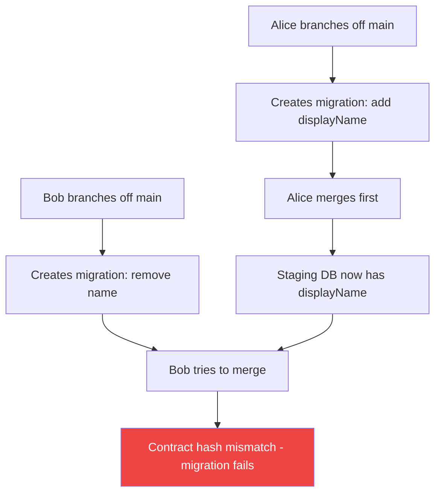
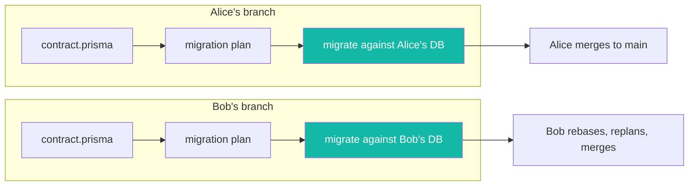
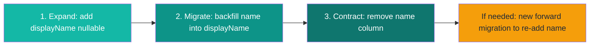

Per-branch databases on [Prisma Compute](https://www.prisma.io/docs/compute) give every pull request its own database and its own migration history. No shared staging environment, no migration conflicts between branches, and a safe place to rehearse destructive changes before they touch production.

This post is part of the [Prisma Next](https://www.prisma.io/docs/orm/next) series. Prisma Next is currently in Early Access and will become Prisma 8 when it reaches general availability. We'll use Prisma Next migrations throughout.

## The shared staging problem

[Prisma Next migrations](https://pris.ly/ts-migrations-pn) track a contract hash per migration. Each migration expects the database to be in a specific state before it starts, and guarantees a specific state when it finishes. That's what makes re-runs safe and errors precise.

A shared staging database has one state. Multiple branches need different ones. When two developers ship schema changes in the same sprint, they collide:

1. Alice branches off `main`, adds a `displayName` column, and runs `prisma-next migrate` against the shared staging database.
2. Bob branches off `main`, removes a legacy `name` column, and runs `prisma-next migrate` against the same database.
3. Alice merges first. Her migration becomes the new baseline on `main`.
4. Bob tries to merge. His migration was created against the old contract, so the contract hash check fails. The staging database now reflects Alice's migration, not the one Bob's migration expects.

The conventional fixes all paper over the mismatch:

- **Rebase and replan**: Bob rebases, replans his migration, and hopes it still does what he intended. Works for additive changes. Gets fragile with data transformations.
- **Reset staging on every merge**: Blow away the shared database and re-apply all migrations from scratch. Works technically, but kills any integration testing that relied on that data.
- **Sequential merges only**: Only one person touches the schema at a time. This is the de facto standard, and it's slow.



None of these fixes address the root cause: one database, multiple migration timelines.

## Per-branch databases on Prisma Compute

[Prisma Compute](https://www.prisma.io/docs/compute) gives each branch its own isolated Postgres database. When you push a branch, Compute provisions a new database for that branch name (or reuses an existing one). When you deploy, your app and migrations run against that branch's database.

- Alice's branch gets its own database with its own contract state.
- Bob's branch gets a different database with a different contract state.
- Neither conflicts with the other.

When Alice merges, her migration lands on `main` and the production database. When Bob rebases and merges after her, he replans his migration against the updated contract. He can test it against his own branch database first.

The workflow:

```bash
# Create a branch
git checkout -b remove-legacy-field

# Edit your contract (prisma/contract.prisma), then plan the migration
npx prisma-next migration plan

# Apply the migration to your branch's database
npx prisma-next migrate --db "$DATABASE_URL"

# Deploy the app to Compute (creates/updates the branch)
npx @prisma/cli@latest app deploy --branch remove-legacy-field
```



No conflicts. No rebasing until you're ready to merge. No shared staging database.

## Expand-and-contract with Prisma Next

Per-branch databases solve the concurrency problem. But they don't solve the production safety problem. What happens when you need to rename a column, change a type, or drop a field that production code still reads?

Expand-and-contract. Instead of one migration that breaks everything, you split the change across three migrations:

1. **Expand**: Add the new schema alongside the old. Both old and new code paths work.
2. **Migrate**: Backfill data from the old structure to the new, inside the migration.
3. **Contract**: Remove the old schema. Only new code paths remain.

This pattern is well-known but rarely practiced, because it requires running multiple migrations against a shared database where other developers are also deploying changes. Per-branch databases remove that friction. You can rehearse the entire cycle on an isolated database before touching production.

### Step 1: Expand (add the new column)

Add `displayName` to your contract as nullable so old code still works:

```prisma
// contract.prisma
model User {
  id          Int     @id @default(autoincrement())
  email       String  @unique
  displayName String? // new field, nullable so old code still works
  name        String  // old field, kept for now
}
```

Plan and apply the migration:

```bash
npx prisma-next migration plan
npx prisma-next migrate --db "$DATABASE_URL"
```

The planner writes a TypeScript migration file:

```typescript
// migrations/20260724T1000_add_user_display_name/migration.ts

import {
  Migration,
  runMigration,
  addColumn,
} from "@prisma-next/target-postgres/migration";

export default class M extends Migration {
  override describe() {
    return {
      from: "sha256:a1b2c3...",
      to: "sha256:d4e5f6...",
    };
  }

  override get operations() {
    return [
      addColumn("public", "user", {
        name: "displayName",
        typeSql: "text",
        nullable: true,
      }),
    ];
  }
}

runMigration(import.meta.url, M);
```

Deploy this branch. Old code still reads `name`. New code can start writing to `displayName`.

### Step 2: Migrate (backfill data)

Instead of a standalone script that runs outside your migration history, Prisma Next lets you backfill data [inside the migration](https://pris.ly/data-migrations-pn) using the same type-safe query builder you use in your app:

```typescript
// migrations/20260724T1100_backfill_display_name/migration.ts

import {
  Migration,
  runMigration,
  dataTransform,
  setNotNull,
} from "@prisma-next/target-postgres/migration";
import postgres from "@prisma-next/postgres/runtime";
import endContractJson from "./end-contract.json" with { type: "json" };
import type { Contract } from "./end-contract";

const db = postgres<Contract>({
  contractJson: endContractJson,
});

export default class M extends Migration {
  override describe() {
    return {
      from: "sha256:d4e5f6...",
      to: "sha256:g7h8i9...",
    };
  }

  override get operations() {
    return [
      this.dataTransform(endContract, "backfill-user-displayName", {
        check: () =>
          db.sql.user
            .select("id")
            .where((f, fns) => fns.eq(f.displayName, null))
            .limit(1),
        run: () =>
          db.sql.user
            .where((f, fns) => fns.eq(f.displayName, null))
            .update({ displayName: "Anonymous" }),
      }),
      setNotNull("public", "user", "displayName"),
    ];
  }
}

runMigration(import.meta.url, M);
```

The `dataTransform` operation takes two callbacks: `check` asks "does this still need to run?" and `run` performs the change. Both use the Prisma Next query builder, typed against the contract snapshot for this migration. The `check` drives the precheck (decides whether `run` needs to execute) and the postcheck (verifies the change had its intended effect). The `run` becomes the execute statement.

This compiles to the same `precheck` / `execute` / `postcheck` JSON shape as every other migration operation. Your team can review the intent in `migration.ts` and the exact SQL in `ops.json`. The migration runner never executes TypeScript in production; it reads `ops.json`.

Run this against your branch database. You can test it in isolation, verify the data, and only then promote to production.

### Step 3: Contract (remove the old column)

Once all production code reads `displayName` and the backfill is complete, remove the old field:

```prisma
// contract.prisma
model User {
  id          Int    @id @default(autoincrement())
  email       String @unique
  displayName String // now required
  // name removed
}
```

```bash
npx prisma-next migration plan
npx prisma-next migrate --db "$DATABASE_URL"
```

Deploy. The old column is gone. If something goes wrong, you write a new forward migration that re-adds `name` and re-runs the backfill in reverse. You never need to "roll back" a migration. You move forward.



## Why you can't just "roll back" a migration

Promoting an earlier deployment on Prisma Compute restores your app code, not your schema. The database keeps the schema from the most recent migration. App code reverts, database doesn't.

Prisma Next's migration history is append-only by design. Rolling back a migration would require generating and applying an inverse migration, which is unsafe for production data. You can't un-drop a column.

That's why expand-and-contract matters. If you need to "undo" a schema change, you deploy a new forward migration that re-adds the old structure. The extra work buys you safety. Per-branch databases make it practical because you can rehearse the entire cycle on an isolated database before touching production.

## CI: making it automatic

The manual workflow is fine for getting started. For teams with CI, automate it:

```yaml
# .github/workflows/compute-deploy.yml
name: Compute Branch Deploy

on:
  pull_request:

jobs:
  deploy-preview:
    runs-on: ubuntu-latest
    steps:
      - uses: actions/checkout@v4

      - uses: actions/setup-node@v4
        with:
          node-version: 22

      - run: npm ci

      - name: Plan and apply migration
        run: |
          npx prisma-next migration plan
          npx prisma-next migrate --db "$DATABASE_URL"
        env:
          DATABASE_URL: ${{ secrets.BRANCH_DB_URL }}

      - name: Deploy to Compute
        run: npx @prisma/cli@latest app deploy --branch ${{ github.head_ref }} --db
        env:
          PRISMA_SERVICE_TOKEN: ${{ secrets.PRISMA_SERVICE_TOKEN }}

      - name: Smoke test
        run: node scripts/smoke-test.mjs
        env:
          DATABASE_URL: ${{ secrets.BRANCH_DB_URL }}
```

Every PR gets its own database, migration run, and smoke test. No other branch is affected.

## When per-branch databases are overkill

Not every team needs this. If you're a solo developer or a small team that rarely touches the schema, shared staging is fine. The conflict rate is low enough that the occasional rebase isn't painful.

Per-branch databases are worth it when:

- Multiple developers ship schema changes in the same sprint
- You're running expand-and-contract migrations that span multiple deploys
- Your CI pipeline runs integration tests against a real database
- You've ever had a migration conflict block a release

If any of those sound familiar, the isolation is worth the infrastructure cost.

## Frequently asked questions

<Accordions type="single">
  <Accordion title="Do per-branch databases copy production data?">
No. Each branch database starts empty. You run migrations against it from scratch, and you seed test data yourself. Production data stays in the production database.
  </Accordion>
  <Accordion title="What happens to a branch database when the branch is deleted?">
When you delete a Git branch that's connected to Compute, the matching platform branch and its database are torn down automatically. Production and default branches are never removed by cleanup.
  </Accordion>
  <Accordion title="Can I use per-branch databases without Prisma Next?">
Yes. The isolation comes from Prisma Compute's branching model, not from Prisma Next. You can use Prisma 7's `prisma migrate deploy` against a branch database the same way. This post uses Prisma Next because its TypeScript migrations and `dataTransform` make expand-and-contract easier to write and review.
  </Accordion>
  <Accordion title="How does this compare to Neon's branching?">
Neon branches copy the database schema and data from a parent branch. Compute branch databases start empty and build up from migrations. Copying data is faster for manual testing; starting empty guarantees your migrations work end-to-end and avoids leaking production data into previews.
  </Accordion>
</Accordions>

## Try it yourself

[Prisma Next is in Early Access](https://www.prisma.io/blog/prisma-next-early-access-write-your-contract-prompt-your-agent-ship-your-app). It's not production-ready yet; Prisma 7 is the right choice for production today. When Prisma Next is ready for general use, it becomes Prisma 8.

But you can try per-branch databases and Prisma Next migrations now:

```bash
pnpx prisma-next init
```

Start a project, write a contract, plan a migration, and see what `migration.ts` and `ops.json` look like. For the expand-and-contract workflow, add a nullable column, write a `dataTransform`, and apply it. Tell us what worked and what didn't on [Discord](https://pris.ly/discord) in the `#prisma-next` channel.

**Star and watch [prisma/prisma-next](https://pris.ly/pn-gh) on GitHub** to follow development.
